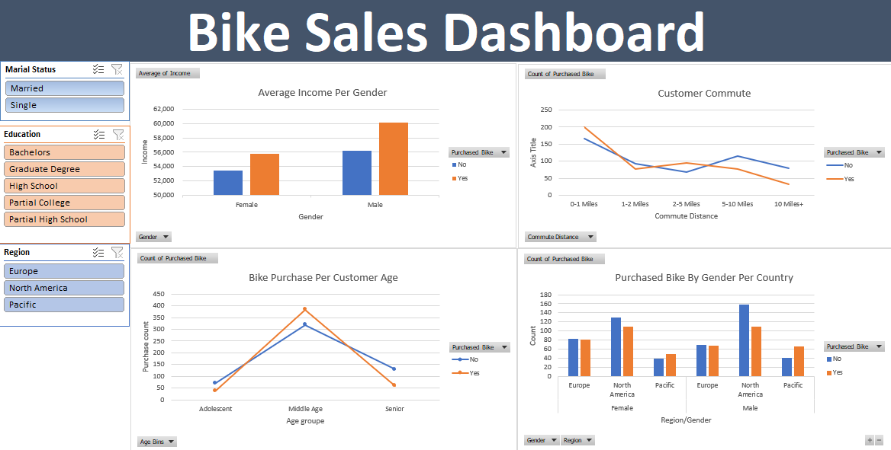

# Bike Sales Data Analysis (Excel Project)

This is a self-driven data analysis project based on a bike sales dataset from Kaggle. I used Microsoft Excel to clean and analyze the data, create custom columns, answer business questions, and build an interactive dashboard using PivotTables and slicers.

---

##  Dataset Overview

- **Source**: [Kaggle - Bike Buyers Dataset](https://www.kaggle.com/datasets/heeraldedhia/bike-buyers?resource=download) 
- The dataset includes the following fields:
  - ID, Marital Status, Gender, Income, Children
  - Education, Occupation, Home Owner, Cars
  - Commute Distance, Region, Age, Purchased Bike

---

##  Tools & Techniques Used

- **Excel**
  - Data Cleaning: Removed duplicates, standardized text using search & replace
  - Data Transformation:
    - Converted `Income` to Number format
    - Created custom columns:
      - **Age Brackets** using nested `IF` statements
      - **Commute Distance Ranges** using logical formulas
  - PivotTables & Slicers for interactive filtering
  - Charts for data visualization

---

##  Business Questions Answered

1. **What is the average income of people who purchased vs. did not purchase a bike?**  
   → Bike buyers had higher average incomes. Among them, **men had an average income of $60,124**.

2. **How many people who purchased a bike commute less than 1 mile to work?**  
   → **20%** of those who purchased a bike had a **0–1 mile** commute to work.

3. **What is the age distribution of bike buyers?**  
   → Around **40%** of bike buyers fall within the **30–54 age range**.

---

##  Dashboard

An interactive Excel dashboard was built using:
- PivotTables
- Slicers to filter data dynamically

  

---

##  How to View the Project

1. Clone or download this repository
2. Open the `Bike_Sales_Analysis.xlsx` file in Microsoft Excel
3. Explore the "Dashboard" tab to interact with slicers and visualizations

---

##  Key Takeaways

- Gained hands-on experience cleaning and transforming real-world data in Excel
- Strengthened logic-building skills using nested `IF` formulas
- Learned to create dashboards for storytelling and insights
- Answered real business questions with data-backed insights

---

## Author

Yasmina Barkouch — Data Analyst Enthusiast

LinkedIn Profile :www.linkedin.com/in/yasminabarkouch
